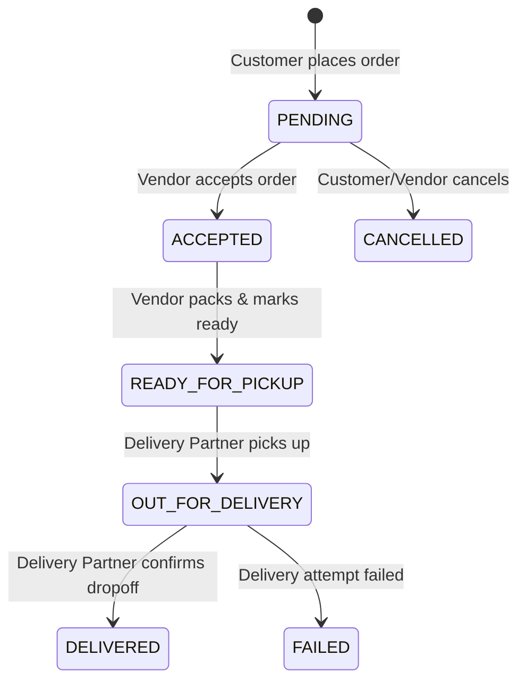

# Multi-Vendor Delivery Management System - Project Summary

Welcome to the **Multi-Vendor Delivery Management System** project. This summary outlines the project architecture, features, styling design system, and directory structure to serve as a comprehensive reference guide for developers and stakeholders.

---

## 📌 1. Project Overview & Target Architecture

This platform is a comprehensive, role-based multi-vendor commerce and delivery management system. It supports interactive workflows between Customers, Shop Owners (Vendors), Delivery Personnel, and System Admins.

### Tech Stack Blueprint
* **Frontend**: HTML5, CSS3, Tailwind CSS (via interactive configuration), Bootstrap 5, and JavaScript (ES6+).
* **Backend**: Python Flask web server.
* **Database**: SQLite (relational database).
* **Real-time Engine**: Flask-SocketIO (for live order status and coordinate push notifications).
* **Analytics**: Chart.js for premium admin and vendor dashboards.
* **Authentication**: Secure session-based authentication with role-based access control (RBAC).

---

## 📂 2. Directory Structure

```text
e-commerce/
├── e commerce PRD.md                       # Comprehensive Product Requirements Document (Word Doc format)
├── PROJECT_SUMMARY.md                      # This summary document
├── stitch_prd_frontend_implementation.zip  # Backup archive of the frontend layouts
└── stitch_prd_frontend_implementation/    # Main frontend implementation directory
    ├── kinetic_commerce_dark/
    │   └── DESIGN.md                       # Design System and UI Design Guidelines
    ├── login_page_dark/
    │   ├── code.html                       # Login Portal (Interactive role selection, developer autofills)
    │   └── screen.png                      # Visual mockup of the login portal layout
    ├── home_screen_dark_updated_layout/
    │   ├── code.html                       # E-commerce Home Page (Interactive search, picks)
    │   └── screen.png                      # Visual mockup of the home layout
    ├── product_detail_page_dark/
    │   ├── code.html                       # Product Detail Page (Reviews, specs, actions)
    │   └── screen.png                      # Visual mockup of the details layout
    ├── product_listing_page_dark/
    │   └── screen.png                      # Visual mockup of the listings layout
    ├── shopping_cart_dark/
    │   ├── code.html                       # Shopping Cart Page (Calculations, checkout review)
    │   └── screen.png                      # Visual mockup of the cart layout
    └── user_profile_dark/
        ├── code.html                       # User Profile Page (Active orders, stats)
        └── screen.png                      # Visual mockup of the profile layout
```

---

## 👥 3. User Roles & Key Features

The system supports four distinct user panels, each customized for a specific actor in the delivery ecosystem:

### 1. Customer Panel
* **Product Search & Discovery**: High-fidelity product grid, categories filter, search, and dynamic personalized recommendation algorithm.
* **Shopping Cart & Checkout**: Interactive item quantity counter, tax/shipping adjustments, and multi-vendor checkout support.
* **Live Order Tracking**: Live order states and delivery status logs.
* **Profile Management**: Profile controls, shipping addresses, and transaction history.

### 2. Shop Owner (Vendor) Panel
* **Product Management**: List new items, update pricing, customize description, and manage inventory levels.
* **Order Processing**: Dashboard to accept/decline incoming customer orders and track ready states.
* **Analytics**: Daily and monthly revenue graphs and popular item sales logs.

### 3. Delivery Boy Panel
* **Job Board**: Real-time acceptance/rejection of available delivery requests.
* **Order Tracking & Pickup**: Complete pickup authorization and address guides.
* **Delivery Confirmation**: One-tap delivery confirmation updates to push final logs to backend databases.

### 4. Admin Panel
* **Global Configuration**: Edit platform variables such as base tax/GST rate, flat-rate delivery expenses, and commission cuts.
* **User Management**: Approve new vendor shops, suspend bad actors, and onboarding protocols.
* **Platform Analytics**: Profit calculations, GST collections, expense balances, and multi-vendor performance reports.

---

## 🔄 4. Order Lifecycle & Status Engine

All transactions transition through a standard finite state machine:



* **Valid Order Statuses**: `PENDING`, `ACCEPTED`, `READY_FOR_PICKUP`, `OUT_FOR_DELIVERY`, `DELIVERED`, `CANCELLED`, `FAILED`.

---

## 🎨 5. The Design System: "Kinetic Commerce Dark"

All visual components utilize a custom-tailored dark theme called **Kinetic Commerce Dark** detailed in `DESIGN.md`.

### Color Palette (Tailwind Integrated)
* **Surface Background**: `#0b1326` (Deep Space Navy) — optimized to minimize eye strain and halation.
* **Surface Container / Cards**: `#1e293b` (Navy-Gray) — creates structural depth without relying on harsh lines.
* **Primary Accent (Indigo)**: `#818cf8` / `#bdc2ff` — vibrant, high-contrast hue used for primary call-to-actions.
* **Secondary Accent (Teal)**: `#44e2cd` — vibrant green-blue tone representing success badges and active tags.
* **Tertiary Accent (Amber)**: `#f7bd3e` — high-contrast gold tint for cart indicators and special deals.

### Premium UI Standards
* **Typography Hierarchy**:
  * **Headlines**: *Hanken Grotesk* for sleek, geometric, bold headings.
  * **Body Copy**: *Inter* for maximum paragraph and label legibility.
  * **Utility / Data Labels**: *JetBrains Mono* for pricing tags, quantities, and numeric telemetry.
* **Glassmorphism Layering**: Active modals and float navbars use semi-transparent fills (`rgba(30, 41, 59, 0.7)`), fine-line outer borders (`1px solid rgba(51, 65, 85, 0.5)`), and backdrop blurs (`backdrop-filter: blur(12px)`).
* **Corner Geometry**: Curved panels (`rounded-xl` for cards, `rounded-full` for chips/pills) to balance and soften the tech-focused workspace look.
